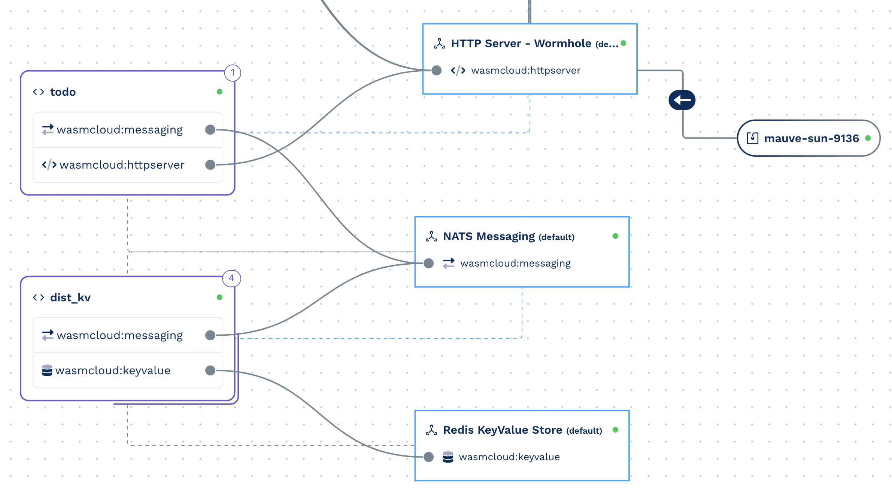
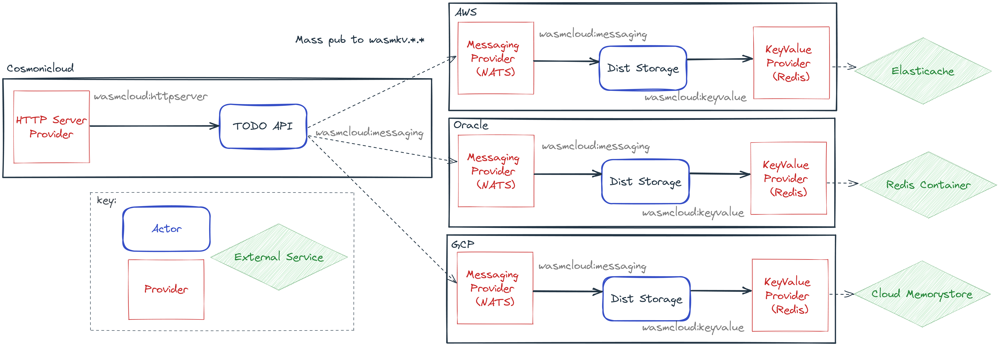

# Wildly Distributed Wasm Demo

An absurd demo showing off the benefits of distributed WebAssembly and wasmCloud. Soon after Cloud Native Wasm day, a similar application will be posted on the Cosmonic [Things to Build](https://cosmonic.com/docs/category/things-to-build/) documentation. This is a deliberately overengineered TODO app that has a couple of awesome features:

## Features

- [x] Data persistence
- [x] Data replication across any number of clouds and edges
- [x] Automatically fetch data from the fastest responder
- [x] Immediate failover during cloud outages

Logically, the structure of the application is flat and consists of three WebAssembly actors:

1. TODO API Gateway that receives HTTP requests over `wasmcloud:httpserver`
1. UI Actor that receives an actor-to-actor call and returns UI assets, no frontend deployment needed
1. Distributed KV actor that receives Messages on `wasmcloud:messaging` and stores TODOs in a keyvalue store using `wasmcloud:keyvalue`

However, the real deployment architecture is completely flexible and as-demoed runs across Cosmonic, AWS, Azure, GCP, and Oracle cloud:

## TODO

- [ ] Implement the update operation on the TODO app
- [ ] Add in config.jsons e.g. `{"url": "redis://elasticache_url.aws.com:6379"}` but with the real demo URLs once the resources are spun down.

## What does this not have?

- [ ] Error handling on distributed sets
- [ ] Data recovery and syncing
